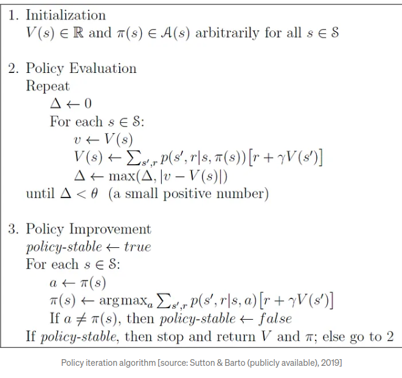

# Theory of Policy Iteration

## Introduction to Policy Iteration

Policy Iteration is a fundamental algorithm in reinforcement learning, particularly suited for optimizing decision-making processes in environments modeled by Markov Decision Processes (MDPs). It's like having a map and a compass in a territory where each crossroad is a decision point that leads to different paths with varying rewards. Policy Iteration methodically tests and refines each route, aiming to discover the most rewarding path through the set of decisions.

Imagine playing a game where every move dictates the outcome, but the best strategies aren't clear-cut. This is where Policy Iteration comes into play. In artificial intelligence, particularly within environments that require a series of decisions leading to a goal, we seek a guide—a policy—that consistently leads to success. Policy Iteration is the rigorous, step-wise guide that leads the path to the best possible decisions in complex, uncertain environments known as Markov Decision Processes (MDPs).

Consider a game of Gridworld, where an agent must navigate through a grid to reach a goal. The agent can move up, down, left, or right, and each action leads to a different cell—or state—on the grid. Some cells might offer rewards (like coins) while others might present penalties (like traps). Policy Iteration helps the agent explore different paths, learn from each move, and ultimately find the most rewarding route to the goal.

## Markov Decision Processes (MDPs)

MDPs offer a structured approach to decision-making problems where outcomes are partly random and partly under the control of a decision-maker. They are defined by:

- **States (S):** The various positions or scenarios in which the decision-maker can find themselves.
- **Actions (A):** The set of decisions or moves the decision-maker can take.
- **Transition Probabilities (P(s'|s,a)):** The likelihood of moving to a new state s' from the current state s after taking action a.
- **Reward Functions (R(s,a,s')):** The immediate payoff received after moving to a new state s' due to action a.
- **Discount Factor (γ):** A metric that values immediate rewards over future ones, influencing the long-term strategy.

The objective is to formulate a policy (π) that specifies the best action to take in each state to maximize the sum of the rewards collected over time.

## Components of Policy Iteration

Policy Iteration consists of two interlocking stages:

- **Policy Evaluation:** This is where we determine the expected return from each state if we follow the current policy.
- **Policy Improvement:** Based on the evaluations, we then adjust the policy by changing the actions in certain states to those that promise better returns.

## Mathematical Framework of Policy Iteration

### Step-by-Step Explanation

1. **Initialization:**
   - Assign a preliminary value function V(s) and policy π(s) for all states s in S.

2. **Policy Evaluation:**
   - Initialize Δ to zero.
   - For each state s in S:
     - Keep the current value V(s).
     - Recalculate V(s) based on the sum of expected returns for all possible next states s':
       `V(s) = Σ P(s'|s,π(s)) [ R(s,π(s),s') + γV(s') ]`
     - Amend Δ to the greatest change in the value of any state.
   - Iterate until Δ is below a small threshold θ, signifying convergence.

3. **Policy Improvement:**
   - Start with the policy assumed to be consistent (policy-stable = true).
   - For each state s in S:
     - Opt for the best action a given the current valuation V(s):
       `π(s) = argmax_a Σ P(s'|s,a) [ R(s,a,s') + γV(s') ]`
     - If there's a change in the policy's action, mark the policy as not yet consistent (policy-stable = false).
   - If no changes occur in the policy, return V and π; if changes are made, resume Policy Evaluation.

### Convergence and Optimality

Policy Iteration is guaranteed to find an optimal policy π* and value function V* after a finite number of iterations, as long as the MDP has a finite set of states and actions. The resulting policy will be the one that maximizes the expected reward from any given state.

## Significance in Reinforcement Learning

Policy Iteration is a critical tool in reinforcement learning for defining clear and effective strategies in environments where each action leads to a new situation. Its precision and methodical nature make it particularly powerful for tasks like navigating mazes or playing strategic games where the goal is to find the most advantageous path.

## Conclusion

The theory and mathematics behind Policy Iteration are essential for anyone looking to apply strategic decision-making in uncertain environments. Its iterative process of evaluation and improvement provides a robust framework for finding the optimal sequence of decisions that lead to the best possible outcomes.

## Code-Snippet:

